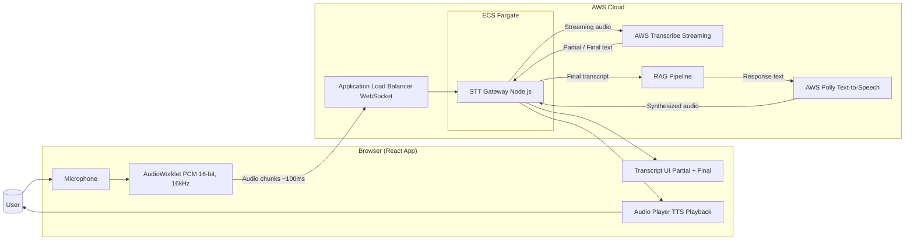

# TALK 2 AI

## Overview

This document describes the solution of bidirectional voice conversation system where users can speak queries and receive spoken responses from an AI assistant.


## Functionality Overview

### **Voice-to-Voice Interaction**
Users can have natural voice conversations with the AI assistant:
- **User speaks** → Real-time transcription via AWS Transcribe
- **User confirms/edits** → Transcript displayed for verification
- **User sends query** → Backend processes and generates response
- **AI responds** → Matthew's voice speaks the answer (AWS Polly)
- **Continuous conversation** → Ready for next query immediately


### System Architecture Diagram




### Component Functionalities
```
┌─────────────────────────────────────────────────────────────┐
│                    Frontend (React)                         │
│  ┌──────────────────────────────────────────────────────┐  │
│  │  VoiceInput Component                                 │  │
│  │  • Conversation state machine                         │  │
│  │  • Audio recording (AudioWorklet)                     │  │
│  │  • WebSocket STT (AWS Transcribe)                     │  │
│  │  • HTTP query API calls                               │  │
│  │  • Audio playback (HTML5 Audio API)                   │  │
│  └──────────────────────────────────────────────────────┘  │
└─────────────────┬───────────────────────┬───────────────────┘
                  │                       │
         WebSocket│(STT)         HTTP POST│(Query)
                  │                       │
                  ▼                       ▼
┌─────────────────────────────────────────────────────────────┐
│              Backend (Node.js on ECS Fargate)               │
│  ┌──────────────────────┐  ┌──────────────────────────┐   │
│  │  WebSocket Handler   │  │   Query Handler          │   │
│  │  • STT streaming     │  │   • Generate response    │   │
│  │  • Real-time trans.  │  │   • Call Polly service   │   │
│  └──────────┬───────────┘  └──────────┬───────────────┘   │
│             │                          │                    │
│             ▼                          ▼                    │
│  ┌──────────────────────┐  ┌──────────────────────────┐   │
│  │  AWS Transcribe      │  │   AWS Polly Service      │   │
│  │  Streaming           │  │   • Neural voice         │   │
│  └──────────────────────┘  │   • Matthew voice        │   │
│                             │   • MP3 synthesis        │   │
│                             └──────────────────────────┘   │
└─────────────────────────────────────────────────────────────┘
```


### Technology Stack

#### **Frontend**
- **React** - UI framework
- **TypeScript** - Type safety
- **WebSocket API** - Real-time STT streaming
- **Fetch API** - HTTP requests for query submission
- **Web Audio API** - Microphone capture, audio playback
- **AudioWorklet** - Low-latency audio processing

#### **Backend**
- **Node.js** - Runtime environment
- **WebSocket Server (ws)** - STT streaming
- **HTTP Server** - Query API endpoints
- **AWS SDK for JavaScript v3** - AWS service integration
- **Docker** - Containerization
- **AWS ECS Fargate** - Container orchestration

#### **AWS Services**
- **AWS Transcribe Streaming** - Real-time speech-to-text
- **AWS Polly Neural** - High-quality text-to-speech
- **AWS ECR** - Container registry
- **AWS ALB** - Load balancing with WebSocket support
- **AWS CloudWatch** - Logging and monitoring
- **AWS IAM** - Secure service access